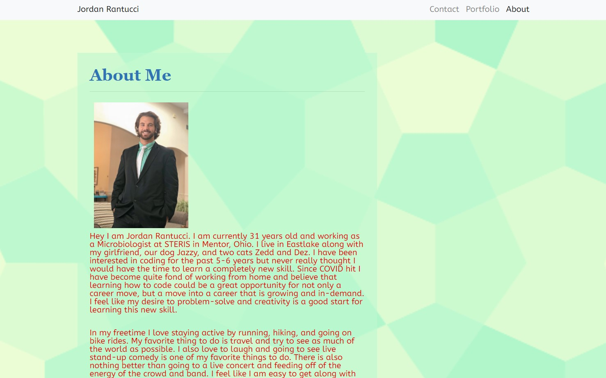
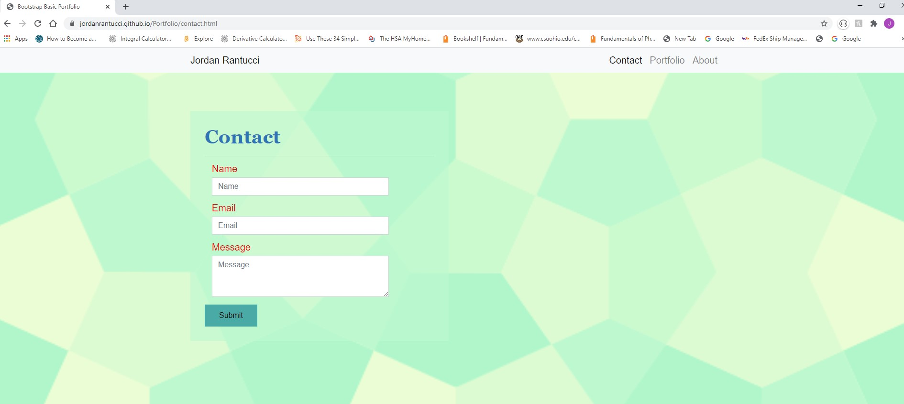
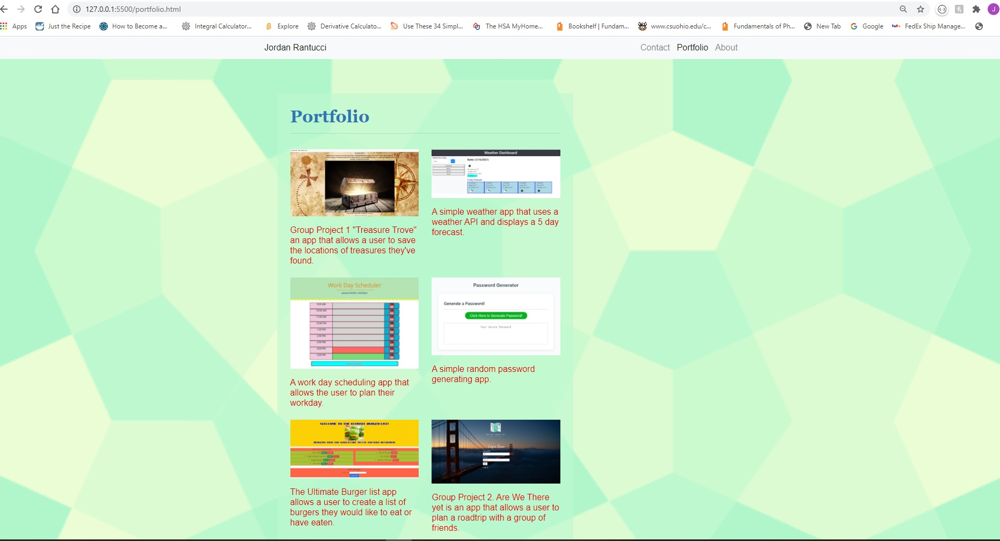

# Portfolio
Jordan's Portfolio

This is a CWRU coding bootcamp Portfolio.  The Portfolio is a display of some of the highlighted works that has been developed in the bootcamp.

## User Story

The portfolio is a simple page that contains links to all of the users platfroms including LinkedIn and GitHub, as well as links to the displayed portfolio images.  The Portfolio is meant to be a highlight of the Creators skills and abilities.  The Portfolio contains works that display knowledge of HTML, CSS, JavaScript and APIs.

## Acceptance Criteria

The application contains a links to all of your professional profiles and highlights your skills and abilities.  The portfolio should be easy to read and does not cause strain to the eye.

Deployed application link: (https://jordanrantucci.github.io/Portfolio/)

The following image demonstrates the application functionality:

## Table of Contents

* [Installation](#installation)
* [Usage](#usage)
* [Credits](#credits)
* [Contributing](#contributing)
* [Tests](#tests)
* [Future](#future)

## Installation

No installation is needed for this project.

## Usage 

Download the code and open to view using your favorite browser, or click the link above to view the deployed site.

## Credits

All Code was created from scratch by  Jordan Rantucci

## Contributing

Contributions in the form of suggestions or feedback are appreciated.

## Tests

There are no tests for this project.

## Future 

Would like to continue to update with more advanced displays of coding ability.  I would like to make the display cleaner and more modern yet still have a resemblance of me. 

---

